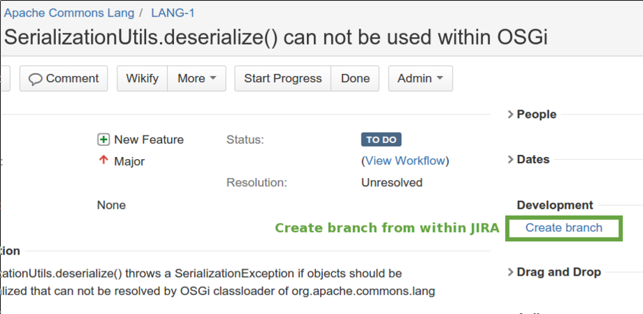
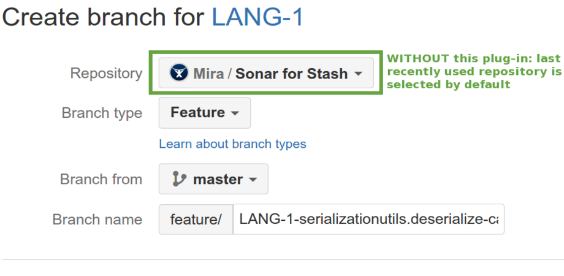
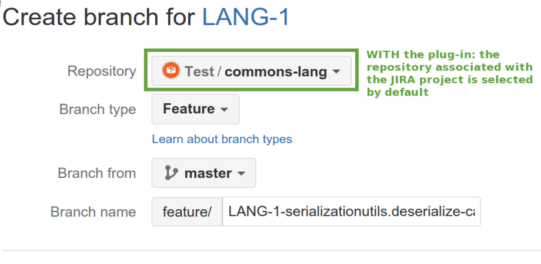

# Create Branch Repository Selector for Bitbucket Server

For more information, please see our [Atlassian Marketplace listing](https://marketplace.atlassian.com/plugins/ch.mibex.stash.rightrepo/server/overview).

## Motivation
The basic workflow this add-on contributes to is when you start creating a branch from JIRA:

This action forwards you to Bitbucket Servers "Create branch" dialog:

Bitbucket Server selects the last recently used repository in the "Create branch" dialog which can be different from the
repository the JIRA issue targets. This can lead to the situation where a branch is created in the wrong 
repository by mistake when the user does not change the branch field accordingly.

This add-on selects the repository that belongs to the JIRA project in the "Create branch" dialog automatically. It
knows which JIRA project a repository belongs to by scanning the commit messages for JIRA issue keys:

## TL;DR
We also have a YouTube video explaining this add-ons' functionality:

## Download
You can download this add-on from the [Atlassian Marketplace](https://marketplace.atlassian.com/plugins/ch.mibex.stash.rightrepo/versions).
